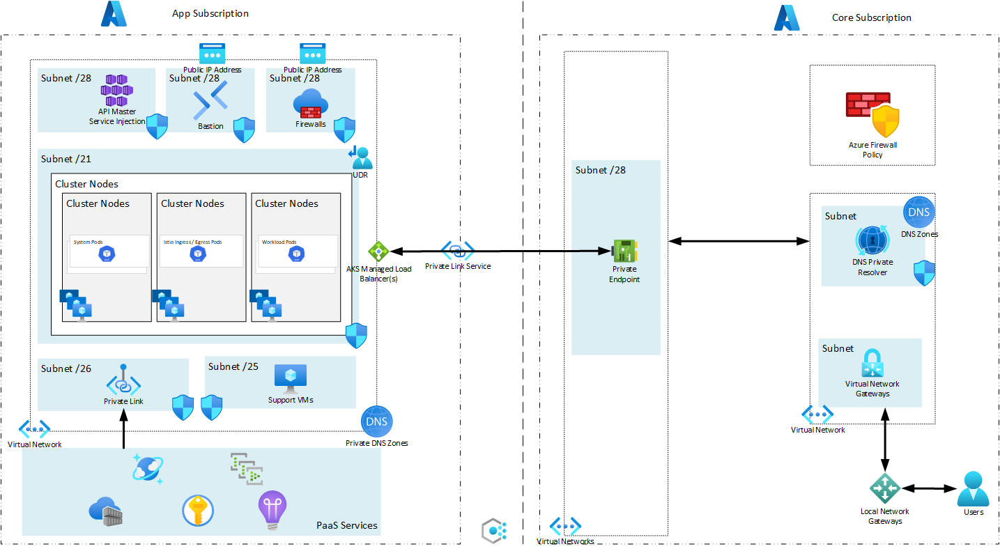
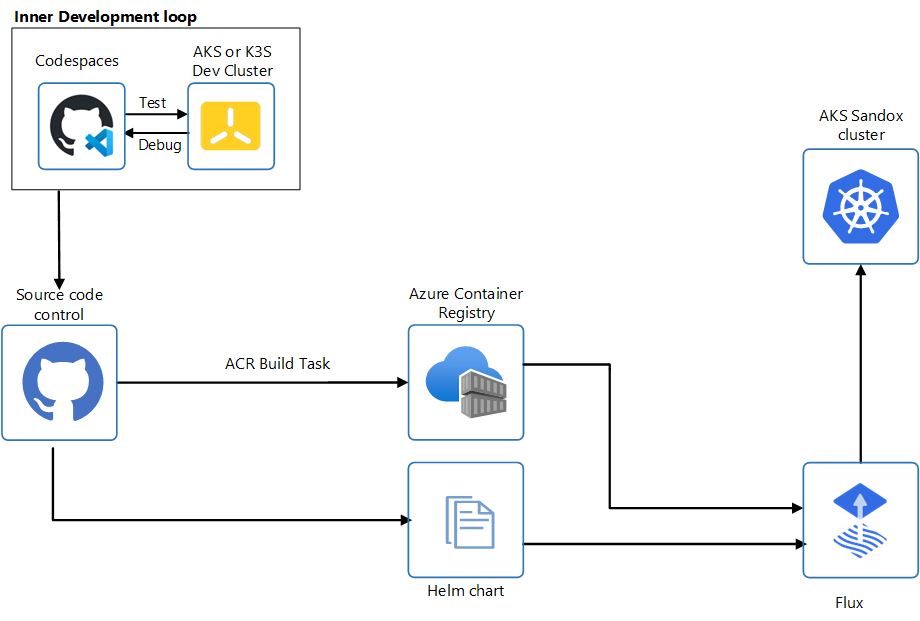

# Overview

This repository is a demonstration of how to build a locked sandbox environment in Azure leveraging Private Link Scope. It is currently a work in progress

## Required Tools Install
_or Use Github Codespacesa and DevContainers_
* [Terraform](https://developer.hashicorp.com/terraform/downloads)

## Required Existing Resources and Configuration
Component | Usage
--------------- | --------------- 
| Two Azure Subscriptions | Application Subscription and Core Subscription |
| Identity granted Owner permissions over each subscription |
| Azure Virtual Network (Core) | A subnet for Private Endpoints |
| Azure VPN Gateway | |
| Azure Firewall Policy | [Required Rules](https://learn.microsoft.com/en-us/azure/aks/outbound-rules-control-egress)
| Private DNS Zones (attached to Core Vnet) | privatelink.azurecr.io |

## Application Azure Subscriptions Requirments
* AKS Preview Features Registered
    * `bash ./scripts/aks-preview-features.sh`

## Components
Component | Usage
------ | ------
Azure Kubernetes Service | Container Orchestration Runtime Platform  
Azure Cosmos DB | Data storage for application 
Azure Key Vault | Secret store 
Azure Event Hubs | Kafka equivalent resource in Azure
Azure Container Registry | Azure Container Registry for containers
Azure Virtual Network  | Azure Virtual Network for all resources and private endpoints
Azure Private Link Service | Exposes AKS Ingress Control back to your Azure Core

# Architecture Diagram


# Infrastructure Deployment 
## Build Environment
```bash
    vi ./infrastructure/azure.tfvars
    #core_subscription                            = "557f5d52-bffc-4582-bd0b-2cd706813031"
    #core_private_endpoint_virutalnetwork_name    = "Core-VNet-001"
    #core_private_endpoint_virutalnetwork_rg_name = "Core_Network_RG"
    #core_dns_rg_name                             = "Core_DNS_RG"
    #core_private_endpoint_rg_name                = "Core_PrivateEndpoints_RG"
    #firewall_policy_rg_name                      = "Core_Firewall_RG"
    #firewall_policy_name                         = "proxy-southcentral-policy"

    az login --scope https://graph.microsoft.com/.default #Code requires AAD permissions 
    terraform -chdir=./infrastructure workspace new southcentralus || true
    terraform -chdir=./infrastructure workspace select southcentralus
    terraform -chdir=./infrastructure init
    terraform -chdir=./infrastructure apply -auto-approve -var "region=southcentralus" -var-file="./infrastructure/azure.tfvars"
```
## Destory Environment
```bash
    az login --scope https://graph.microsoft.com/.default
    terraform -chdir=./infrastructure destroy -auto-approve -var "region=southcentralus" -var-file="./infrastructure/azure.tfvars"
```

# Application Deployment
## CI/CD Overview


### Lifecycle
1. Developer checkouts out branch in code repository using Github Codespaces.
1. Developer updates code and develops againist a dedicated mini-cluster either in the Codespace or against AKS in Azure
1. Developer checks in Code
1. Azure Container Registry has a Build Task configured to monitor for code changes
1. Azure Container Registry builds the application container
1. Developer Updates Helm chart with new container version
1. Flux on the Sandbox AKS cluster monitors for updates for updates to the Helm chart and deploys updated code to the cluster

# Application Troubleshooting 
##  Azure Monitor
* Diagnostic Logging for each Azure resource will be sent to the Sandbox's Log Analtyics resource 
* AKS Cluster Insights is configured to ship node and pod utilization as well as container stdout/stderr to the Sandbox Log Analtyics resource
* Application should include AppInsights SDK or Otel SDK to send application logs to the Sandbox's AppInsights resource
* The environment can be updated to incldue Azure Manage Grafana and Azure Managed Prometheus 

## AKS Run Invoke Command
* The Azure Cli AKS subcommand has the ability to run commands on a private AKS cluster without having direct connectivity.  
* This can be used for one-off commands including viewing logs
```bash
    az aks command invoke -g pony-36358_rg -n pony-36358-aks --command 'kubectl get nodes'
    NAME                              STATUS   ROLES   AGE    VERSION
    aks-default-86141613-vmss000000   Ready    agent   134m   v1.26.3
    aks-default-86141613-vmss000001   Ready    agent   134m   v1.26.3
    aks-default-86141613-vmss000002   Ready    agent   134m   v1.26.3
    aks-default-86141613-vmss000003   Ready    agent   108m   v1.26.3
    aks-default-86141613-vmss000004   Ready    agent   64m    v1.26.3

    az aks command invoke -g pony-36358_rg -n pony-36358-aks --command 'kubectl get pods -n bookstore'
    NAME                              READY   STATUS    RESTARTS   AGE
    details-v1-bdb97665b-ptqn4        2/2     Running   0          106m
    productpage-v1-6f769fcbc6-qxlww   2/2     Running   0          106m
    ratings-v1-5744f4c948-ll89x       2/2     Running   0          106m
    reviews-v1-98c4d66d-m68kl         2/2     Running   0          106m
    reviews-v2-58778c5cb-4h8jp        2/2     Running   0          106m
    reviews-v3-85f56ccb56-2dtd9       2/2     Running   0          106m

    az aks command invoke -g pony-36358_rg -n pony-36358-aks --command "kubectl logs todoapi-84664fcfc8-qnxpg"
    info: todoapi[0]
        Application is ready to run.
    warn: Microsoft.AspNetCore.Server.Kestrel[0]
        Overriding address(es) 'http://+:80'. Binding to endpoints defined via IConfiguration and/or UseKestrel() instead.
    info: Microsoft.Hosting.Lifetime[14]
        Now listening on: https://0.0.0.0:8443
    info: Microsoft.Hosting.Lifetime[0]
        Application started. Press Ctrl+C to shut down.
    info: Microsoft.Hosting.Lifetime[0]
        Hosting environment: Production
    info: Microsoft.Hosting.Lifetime[0]
        Content root path: /app/
    info: Todos.TodoController[0]
```

## Temporary Windows Machine
* At times, VM resources maybe required to do deep dive troubleshooting.  
* This can be accessed through Azure Bastion
* Native tooling can be used with Azure Bastion Standard SKU
    * `az network bastion tunnel` creates a secure tunnel to your VM through Bastion
    * Example: `az network bastion tunnel --name pony-36358-bastion --resource-group pony-36358_rg --target-resource-id /subscriptions/aa1194f5-8ca0-4445-9b3e-bb28c31d93f0/resourceGroups/pony-36358_rg/providers/Microsoft.Compute/virtualMachines/pony-36358-vm --resource-port 22 --port 2222`
    * You then can ssh into the VM with: `ssh admin@127.0.0.1 -p 2222`
* A pre-built Windows 11 VM with all required tooling and Subsystem for Linux installed

# LICENSE
See [LICENSE](LICENSE).